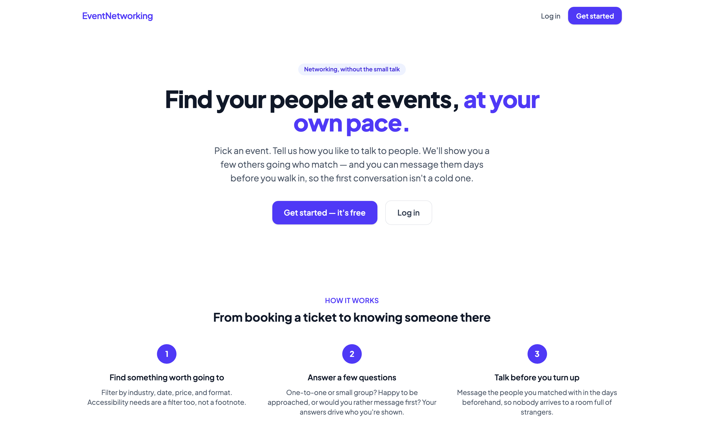
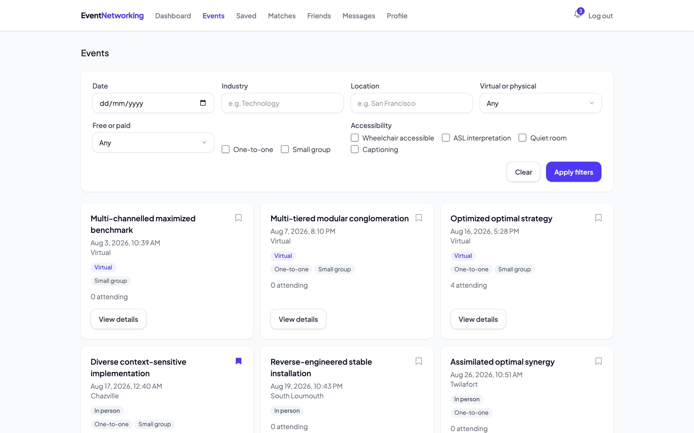
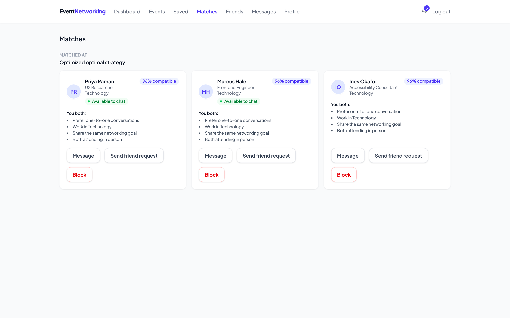
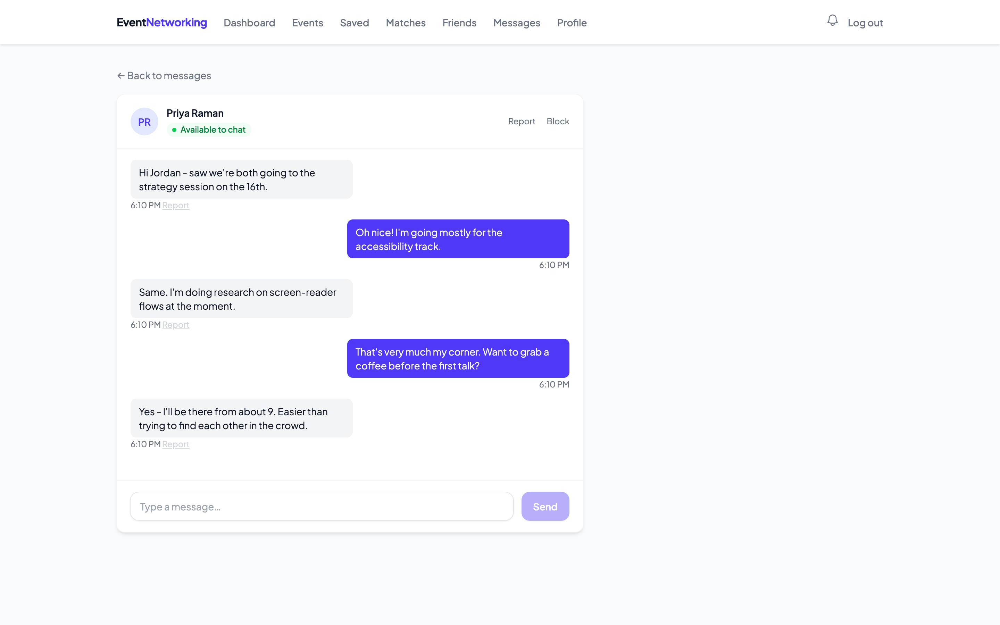
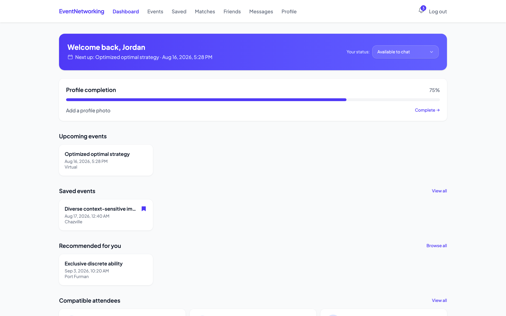
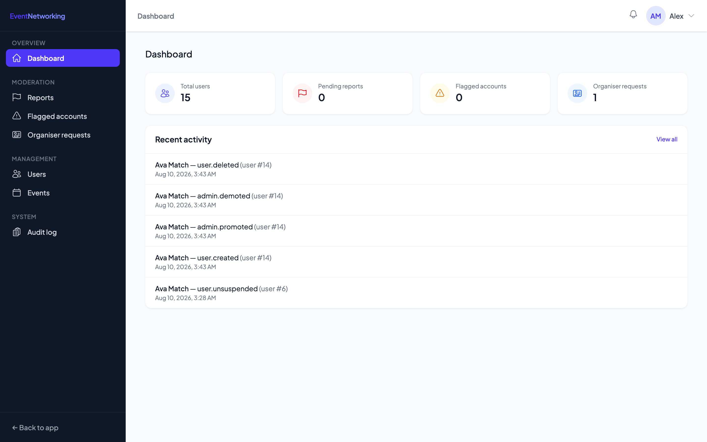
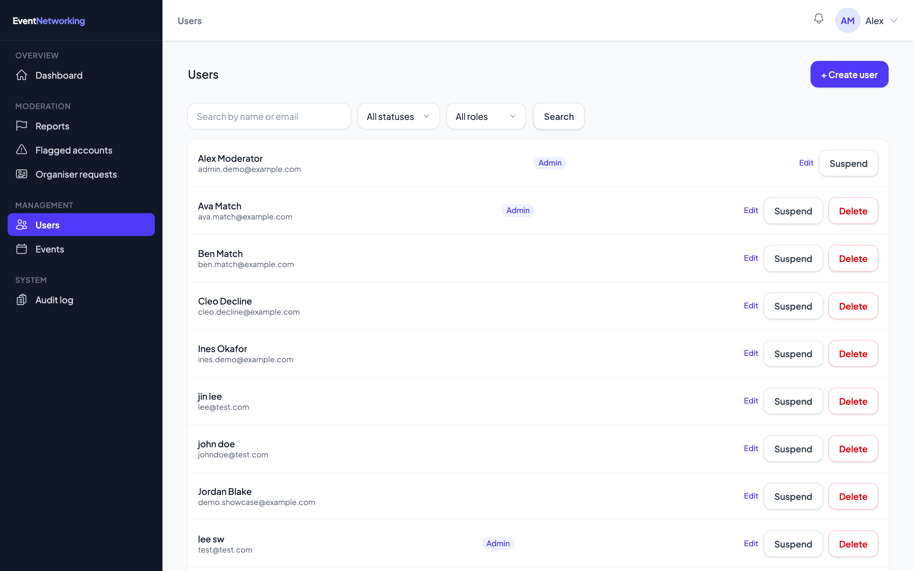

# Event Networking

Most networking apps assume you want to walk into a room and work it. This one
doesn't. It's built for people who find that exhausting. You pick an event, say
how you actually like to talk to people, and the app finds a handful of others
going who match that. You can message them days before you turn up, so the first
conversation isn't a cold one.

Laravel API on the back, Vue 3 on the front. Real-time chat over WebSockets.
About 360 tests across both halves.



---

## What it does

**Events.** Browse by industry, date, location, price, and format. Wheelchair
access, ASL interpretation, captioning and quiet rooms are all filters you can
tick, rather than something you have to hunt for in the description. Bookmark
anything you're unsure about.



**Matching that shows its working.** When you register for an event you answer a
few questions: one-to-one or small group, how big a group is too big, whether
you'd rather message first. That plus a ten-question style quiz feeds a
compatibility score. The score is never shown on its own. Every match lists the
specific reasons behind it, so you can look at those and decide it's wrong.



**Messaging with brakes on it.** Chat is live over Laravel Reverb. You can set an
availability status and conversation boundaries (text only, no spontaneous calls,
ask before adding me to a group), and other people see them before they message.
There are conversation starters if you're staring at an empty box.



**A dashboard that's actually about you.** What's coming up, what you bookmarked,
and how much of your profile is still blank.



**Moderation tools.** Report an account, an event, or a single message. Admins
get a queue, a flagged-accounts view driven by report counts, suspend and delete
with email notification, organiser approvals, and an audit log of every
moderator action.





---

## Stack

| | |
|---|---|
| API | Laravel 13, PHP 8.3+ |
| Auth | Sanctum bearer tokens |
| Database | MySQL 8 (SQLite in tests) |
| Real-time | Laravel Reverb + Laravel Echo |
| Frontend | Vue 3, Vite, Pinia, Vue Router, Tailwind v4, Axios |
| Tests | Pest (225) and Vitest (136) |

Some things worth knowing about how it's put together:

Every API error comes back in one shape, `{success, message, errorCode}`, handled
centrally in `bootstrap/app.php` rather than each controller inventing its own.
The frontend has a matching `getApiError()` helper, so no catch block anywhere
digs through `error.response.data` by hand.

Deleting a user or an event soft-deletes it. Admins can still find them with a
status filter.

Rate limiting is switched on (Laravel 11+ ships it off), with a much stricter
limiter on login, register, and password reset. That one is keyed by email *and*
IP together, so a single address can't cycle through accounts and a spread of
addresses can't gang up on one.

---

## Why there's a `setup.sh`

This project was built in a sandbox with no PHP runtime and no package registry,
so the Laravel skeleton itself (`composer.json`, `config/`, `public/index.php`)
couldn't be scaffolded here. Everything application-specific lives in
`server-overlay/`: models, controllers, form requests, migrations, routes,
middleware, services, and the full Pest suite.

`setup.sh` creates a real Laravel project with Composer, copies the overlay on
top, installs Sanctum and Pest, migrates, and runs both test suites. You should
get a passing build on the first go.

If you change backend code afterwards, edit it in `server-overlay/` and copy it
across to `server/`. The overlay is the source of truth; `server/` is the
runnable copy.

## Running it

You'll need PHP 8.3+, Composer, MySQL 8, Node 18+, and the `pdo_sqlite`
extension (the test suite uses it).

```bash
chmod +x setup.sh
./setup.sh
```

Then three terminals:

```bash
cd server && php artisan serve
```

```bash
cd server && php artisan reverb:start
```

```bash
cd client && npm run dev
```

Reverb is only needed for live message delivery. Skip it and everything else
still works; messages just won't arrive until you reload.

## Tests

```bash
cd server && php artisan test
```

```bash
cd client && npx vitest run
```

Both run in CI on pushes to `main` and on every pull request. The backend suite
covers auth, events and registration, matching, friend requests and blocks,
messaging permissions, reporting, and every admin endpoint. The frontend suite
covers the Pinia stores, the route guards, and the components with real logic in
them.

## Making yourself an admin

```bash
cd server && php artisan admin:promote you@example.com
```

Log in again and you'll land on `/admin` instead of the dashboard.

## Layout

```
client/          Vue 3 SPA
  src/pages/     20 member pages, 9 admin pages
  src/stores/    Pinia, one store per domain
  src/services/  Axios client, Echo client, error helper
  tests/         Vitest
server-overlay/  Application code. Edit here.
server/          Generated Laravel project. Runs here.
setup.sh         Scaffolds server/ from the overlay
PLAN.md          The task-by-task build plan
```

## Where it's rough

Notifications are derived from unread messages and pending friend requests rather
than stored. There's no notifications table yet, so nothing persists and you
can't mark anything as read.

Event images are a single cover image with no cropping step.

The compatibility quiz is ten fixed questions with fixed weights. It doesn't
learn from whether matches actually went anywhere.
